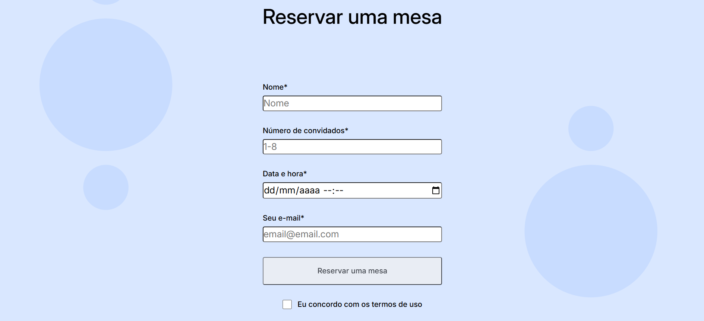

# Triple Espresso

## Live Demo

http://rodrigomzanetti.github.io/web_project_coffeeshop/

## Preview

## Overview

Triple Espresso is a front-end website designed to simulate a fictional coffee shop. The project focuses on building a structured and visually consistent landing page using semantic HTML and modular CSS architecture.

The main goal of the project was to strengthen front-end fundamentals by applying the BEM methodology for scalable styling and maintaining a clear separation between structure and presentation.

## Features

- Semantic and well-structured HTML layout
- Responsive page sections and organized CSS styling
- Navigation menu linked to different sections of the page
- Reservation section with a table booking form
- Recipes section designed to increase user engagement
- Footer with branding elements and social media links
- Modular CSS architecture using BEM methodology

## Technologies Used

- HTML5 – semantic structure and content organization
- CSS3 – layout, styling, and responsive behavior
- BEM methodology – structured and maintainable CSS architecture
- Git and GitHub – version control and project management

## Project Structure

web_project_coffeeshop/

- index.html – main page structure
- blocks/ – modular CSS blocks using BEM
- pages/ – page-specific styles
- images/ – project assets

## How to Run the Project

- Clone the repository
git clone https://github.com/RodrigoMZanetti/web_project_coffeeshop.git

- Navigate to the project folder
cd web_project_coffeeshop

- Open the project
Open **index.html** in your browser or run a local development server if preferred.

## Status

Completed as part of front-end development training.

## Problem Solving

The main challenge in this project was organizing the page structure while maintaining scalable and readable CSS. This was addressed by dividing styles into independent BEM blocks, allowing each section of the page to remain modular and maintainable.

Special attention was given to semantic HTML structure, clear navigation flow, and visual consistency across sections of the page.

## What I Learned

During this project I practiced:

- Structuring semantic HTML layouts
- Organizing scalable CSS using the BEM methodology
- Separating layout structure from visual styling
- Creating modular CSS blocks
- Designing clean and readable front-end architecture

## Author

Rodrigo M. Zanetti

GitHub  
https://github.com/RodrigoMZanetti

LinkedIn  
https://www.linkedin.com/in/rodrigomaturanozanetti/
